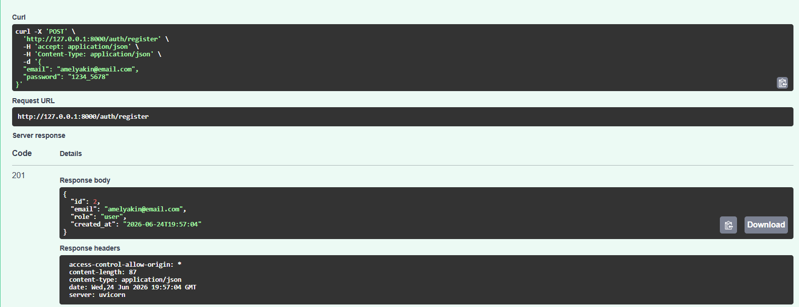
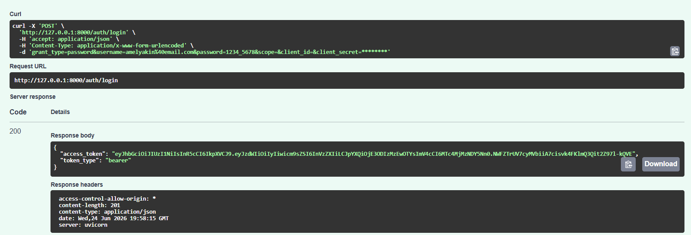
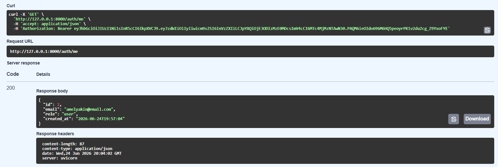
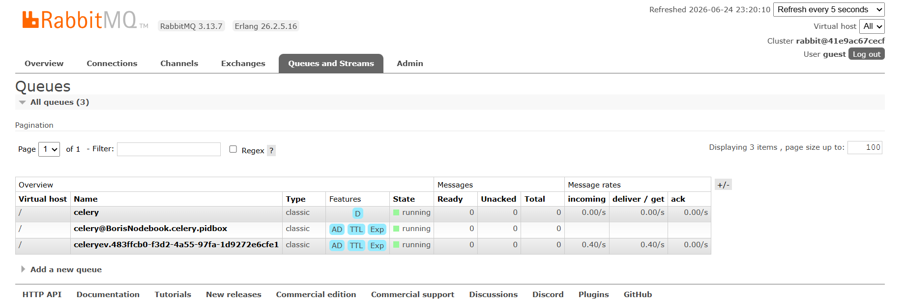
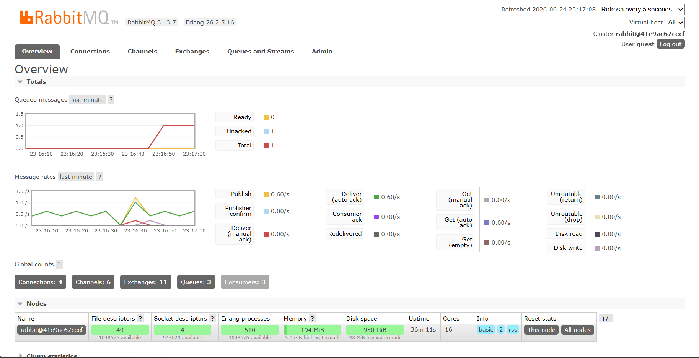
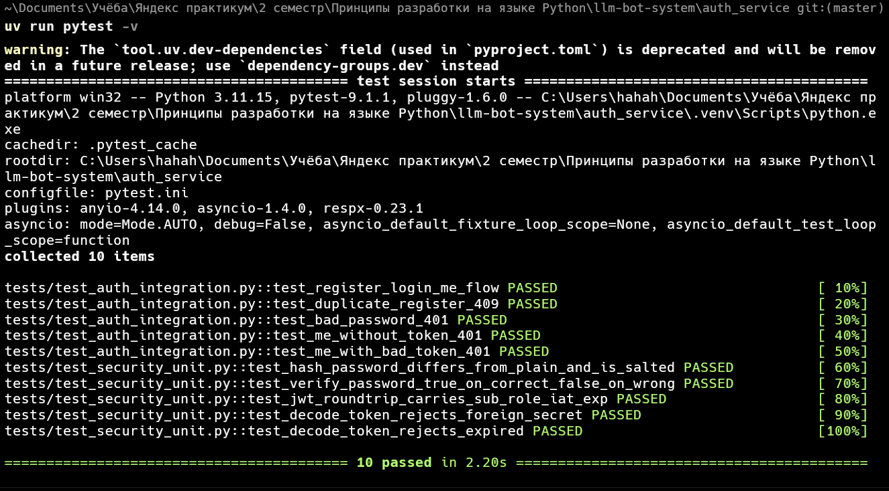
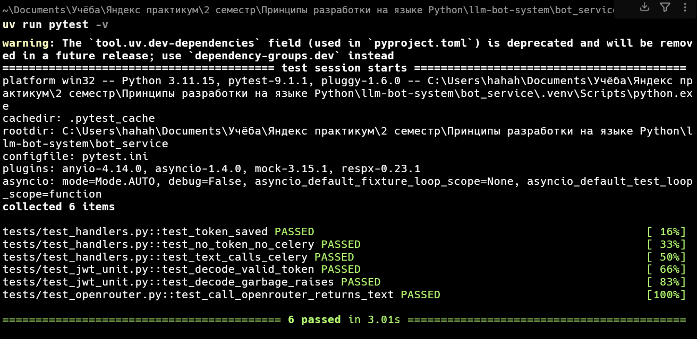

# llm-bot-system

Распределённая система LLM-консультаций из двух независимых сервисов: сервис
аутентификации и Telegram-бот. Бот не ходит в LLM напрямую, а ставит задачу в
очередь, которую разбирает Celery-воркер. Итоговый учебный проект Яндекс Практикума.

## Состав

- **auth_service** - FastAPI: регистрация, логин, выпуск JWT, хранение пользователей в SQLite.
- **bot_service** - aiogram: валидирует JWT (но сам его не выпускает), кладёт запросы в
  очередь и через Celery + RabbitMQ обращается к LLM (OpenRouter). Redis хранит токены
  пользователей и результаты задач.

Два сервиса полностью независимы: у каждого свой `pyproject.toml`, `.env`, окружение и
тесты. Связывает их только общий секрет JWT.

## Архитектура

```
   HTTP (login/register)        ┌──────────────┐
  ──────────────────────────▶   │ Auth Service │ ──▶ SQLite (пользователи)
                                 │   FastAPI    │
        JWT (HS256)  ◀────────── │              │
                                 └──────────────┘
                                        │ общий секрет JWT_SECRET
                                        ▼
   сообщение в Telegram          ┌──────────────┐   /token <jwt>   ┌─────────┐
  ──────────────────────────▶    │ Bot Service  │ ───────────────▶ │  Redis  │ token:<tg_id>
                                 │   aiogram    │ ◀─ читает токен ─ │         │
                                 └──────────────┘                  └─────────┘
                                        │ llm_request.delay(chat_id, prompt)
                                        ▼
                                 ┌──────────────┐
                                 │   RabbitMQ   │  брокер задач
                                 │   (broker)   │
                                 └──────────────┘
                                        │ consume
                                        ▼
                                 ┌──────────────┐   HTTP    ┌────────────┐
                                 │ Celery worker│ ────────▶ │ OpenRouter │
                                 │              │ ◀──────── │    LLM     │
                                 └──────────────┘   ответ   └────────────┘
                                        │ результат -> Redis backend
                                        │ ответ -> Telegram sendMessage
                                        ▼
                                  пользователь в Telegram
```

### Асинхронная цепочка

Ключевая идея: хэндлер бота **не вызывает LLM сам**. Он только проверяет токен и
публикует задачу `llm_request` в RabbitMQ, сразу отвечая пользователю "Запрос принят".
Дальше задачу подхватывает Celery-воркер: зовёт OpenRouter, доставляет ответ обратно
пользователю через Telegram Bot API, а возвращаемое значение Celery кладёт в Redis как
result-backend. Так бот остаётся отзывчивым, а тяжёлая работа уходит в фон.

### Модель безопасности

JWT выпускает только `auth_service`. Бот знает тот же `JWT_SECRET` и лишь **проверяет**
подпись, срок действия и наличие `sub`. Без валидного токена бот отказывает и просит
авторизоваться. Токены не выдаются на стороне бота никогда.

## Стек

- Python 3.11+, управление окружением через **uv**
- FastAPI, SQLAlchemy async + SQLite (aiosqlite), pydantic-settings
- python-jose (JWT, HS256), passlib (bcrypt)
- aiogram >= 3.10, Celery, RabbitMQ (брокер), Redis (backend + хранилище токенов)
- httpx, OpenRouter
- ruff, pytest, pytest-asyncio, pytest-mock, respx, fakeredis

## Запуск

Инфраструктура (RabbitMQ + Redis) поднимается из корня проекта:

```bash
docker compose up -d        # RabbitMQ UI: http://localhost:15672 (guest/guest)
```

Сами сервисы запускаются локально через uv, каждый отдельным процессом.

**Auth Service** (из `auth_service/`):

```bash
uv sync
uv run uvicorn app.main:app --reload     # Swagger: http://127.0.0.1:8000/docs
```

**Bot Service** (из `bot_service/`) - после установки запускается двумя процессами:

```bash
uv sync
# 1) Celery-воркер (на Windows обязателен -P solo)
uv run celery -A app.infra.celery_app worker -l info -P solo
# 2) сам бот (long polling), в отдельном окне
uv run python -m app.bot.dispatcher
```

В `bot_service/.env` нужно указать `TELEGRAM_BOT_TOKEN`, `OPENROUTER_API_KEY` и тот же
`JWT_SECRET`, что в `auth_service`. Для локального запуска (сервисы на хосте, инфра в
docker) хосты в `.env` указывают на `localhost`.

### Сценарий использования

1. В Swagger: `POST /auth/register`, затем `POST /auth/login` - получить `access_token`.
2. В Telegram: отправить боту `/token <access_token>` - бот проверит и сохранит токен.
3. Отправить боту любой вопрос - ответ от LLM придёт следующим сообщением.

## Тесты

```bash
# из auth_service/
uv run pytest          # 10 тестов: unit security + integration auth flow
# из bot_service/
uv run pytest          # 6 тестов: jwt unit, openrouter (respx), handlers (fakeredis)
```

Все тесты проходят локально, без Docker и реальных внешних сервисов: Redis заменяется на
fakeredis, HTTP к OpenRouter - на respx, `llm_request.delay` мокается.

## Скриншоты

### Auth Service (Swagger)

Регистрация пользователя:



Логин и выдача access_token:



Защищённый `GET /auth/me` с токеном:



### Telegram-бот

Команда `/token`, постановка запроса в очередь и ответ от LLM:


Лог Celery-воркера: задача получена из очереди и успешно обработана:


### RabbitMQ

Активные очереди (`celery` и служебные):



Обзор: активные соединения и consumers (работающий воркер):



### Тесты

Auth Service - 10 тестов:



Bot Service - 6 тестов:


